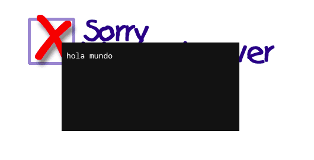

# Reflected XSS Attack
### A03:2021-Injection
Los ataques de **XSS reflejados** consisten en la inyección de código sin almacenamiento en servidor (a diferencia de [los ataques de XSS almacenados](./xss_injection.md)). Al no ser persistentes, los ataques constan de un único ciclo de vida de petición y respuesta, mayormente orientado a campañas de **phising** en las que la URL provista (y aparentemente legítima) ejecute código externo en el navegador del usuario

## Ataque
- **Localización: /index.php?page=media**

En el reconocimiento inicial hemos observado que una de las imágenes embebidas contiene un  **href** que nos redirige a una página donde se renderiza la imagen.

Vemos que la imagen se refleja en el DOM mediante el siguiente tag `object` con un parámtero `src` el cual indica de dónde se ha de obtener la imagen.

```html
<object data="http://192.168.1.244/images/nsa_prism.jpg"></object>
```

El tag object permite inyectar recursos externos, por lo que de alguna manera deberemos ser capaces de poder pasar nuestro payload por el parámetro src y ejecutar código.

La URL usa un segundo query param **src**, que tras un par de pruebas podemos deducir que tiene algún tipo de relación con el campo src del objeto.

```
?page=media&src=https://www.42.fr
```


```
The object element can represent an external resource, which, depending on the type of the resource, will either be treated as an image or as a child navigable.
```
_Extraído de las specs de HTML5_

Se observa que con el parámetro introducido se ha intentado buscar un recurso concatenando con la URL del sitio, y la búsqueda ha devuelto la página html que se ha embebido en el objeto.

Buscamos una forma de introducir directamente información en el objeto sin una petición de recurso con un **data schema**.

Un data schema en una uri nos permite generar recursos **inline**, esto es, el recurso se pasa en la propia uri, y no se intenta recabar ni de forma externa ni desde un sistema de archivos.

Si introducimos inline una cadena de texto con un data schema de la forma:
```
/?page=media&src=data:,hola%20mundo
```

Este es el resultado:



Probamos ahora a inyectar documentos HTML.
```
/?page=media&src=data:text/html,<div>Hola%20mundo</div>
```

Y nos renderiza un objeto **div** con el texto contenido.

Probamos con un elemento script para inyectar código.

```
/?page=media&src=data:text/html,<script>alert(1)</script>
```

Y, efectivamente, ejecuta nuestro payload sin ningún tipo de filtrado.

El último paso es, para que resulte un ataque convincente, obfuscar la url para que el payload no pueda verse a simple vista. [En la propia documentación](https://developer.mozilla.org/es/docs/Web/URI/Reference/Schemes/data) nos indican cómo se puede codificar el parámetro data, así que pasamos el payload por base64 y tratamos de ejecutarlo.

```
/?page=media&src=data:text/html;base64,PHNjcmlwdD5hbGVydCgxKTxcc2NyaXB0Pg==
```

Introduciendo este parámetro obtenemos la flag.

## Mitigaciones

- Replanteamiento del diseño de la aplicación: no debería ser posible para el usuario embeber un archivo sin controlar.
- Validación de input en el servidor: si no es posible modificar la arquitectura, validar input para evitar la inyección de ficheros inline.

## Referencias

- [The external object tag](https://developer.mozilla.org/en-US/docs/Web/HTML/Reference/Elements/object)
- [URI data reference](https://developer.mozilla.org/es/docs/Web/URI/Reference/Schemes/data)
- [OWASP: Cross Side Scripting](https://owasp.org/www-community/attacks/xss/)
- [OWASP: Testing for Reflected Cross Site Scripting](https://owasp.org/www-project-web-security-testing-guide/v41/4-Web_Application_Security_Testing/07-Input_Validation_Testing/01-Testing_for_Reflected_Cross_Site_Scripting.html)