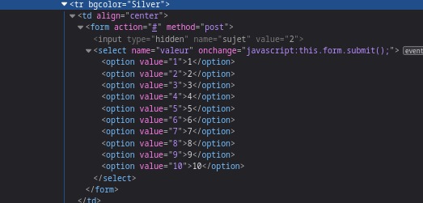

# Hidden form parameter

Pues tenemos opcion de recuperar contraseña en el signin. Damos a submit, y vemos un payload que no hemos metido. Inspeccionamos elemento, vemos un input hidden en el formulario. Editamos el input de mail, submiteamos, por algun motivo nos da una flag.

